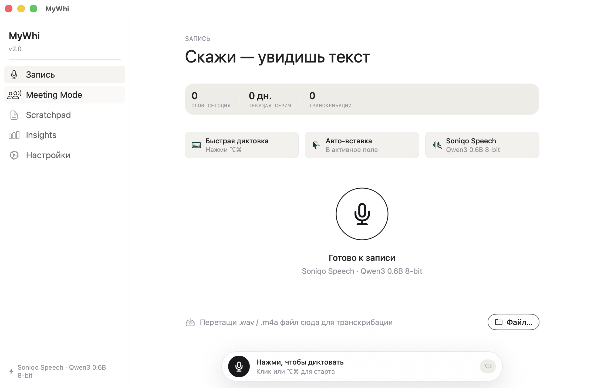
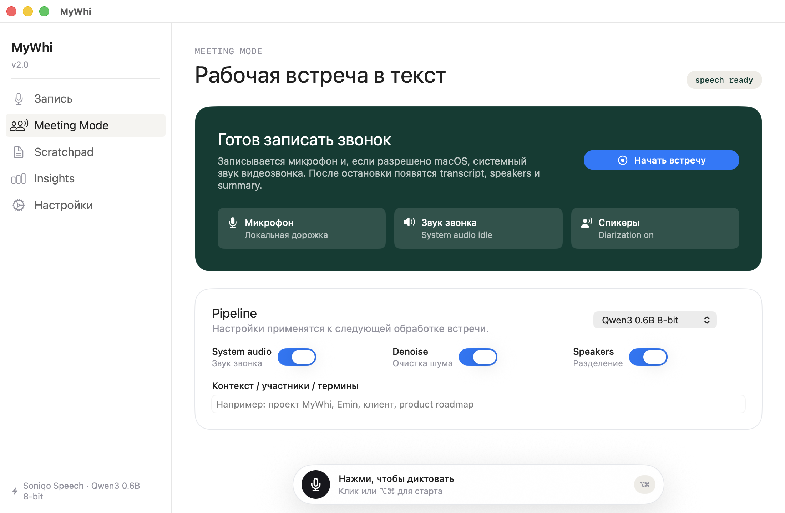
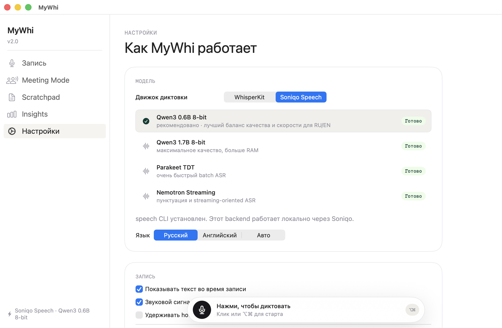

# MyWhi

Local-first macOS dictation and meeting transcription app. MyWhi turns spoken Russian or English into clean text for notes, messages, documents, and work calls without sending audio to a cloud transcription service.

It is built as a native Swift / SwiftUI desktop app for macOS with local speech-to-text backends, global hotkeys, Markdown history, and a dedicated Meeting Mode for long calls.



## What MyWhi Does

- **Fast daily dictation**: press `Option` + `Command`, speak, and get text ready to paste or auto-insert into the active app.
- **Voice message transcription**: drag `.wav` or `.m4a` files into MyWhi and convert them to editable text.
- **Meeting Mode**: record work calls, capture microphone and system audio, then prepare transcript, speaker-aware notes, and summary output.
- **Local speech-to-text**: choose between WhisperKit and Soniqo Speech models for offline ASR on your Mac.
- **RU / EN workflow**: Russian, English, and auto language modes for everyday multilingual work.
- **Markdown vault**: save transcripts locally as Markdown in `~/Library/Application Support/MyWhi/vault/`.
- **Native macOS UX**: menu-bar presence, desktop window, global hotkey, Sparkle updates, no Electron.

## Meeting Mode

Meeting Mode is a separate workspace for calls and long-form recordings. It is designed for work meetings where you need the transcript, speakers, and a useful summary after the call.



The current pipeline focuses on:

- microphone recording
- optional system audio capture for video calls
- Soniqo Speech ASR model selection
- noise cleanup toggle
- speaker separation toggle
- context field for names, projects, and domain terms

## Speech Engines

MyWhi supports two local transcription paths:

- **Soniqo Speech**: recommended default for the current daily dictation workflow. The bundled model selector includes Qwen3 0.6B 8-bit, Qwen3 1.7B 8-bit, Parakeet TDT, and Nemotron Streaming options.
- **WhisperKit**: local Core ML / Metal transcription with cached Whisper models for offline use.



## Why Local-First

- Audio stays on this Mac.
- Transcription runs locally through the selected backend.
- MyWhi does not call a cloud transcription API.
- Temporary recordings are stored under `/tmp/mywhi/recordings/`.
- Saved transcript history is plain Markdown.
- Accessibility permission is used only for optional paste/typing behavior.

## Install

Download the latest DMG from [GitHub Releases](https://github.com/GanbarovEmin/MyWhi/releases).

1. Open `MyWhi-3.9.0.dmg`.
2. Drag `MyWhi.app` to `Applications`.
3. Open MyWhi from `/Applications`.
4. Allow Microphone access when macOS asks.
5. Optional: enable Accessibility permission for auto-paste into the active app.
6. Optional: enable Screen Recording/System Audio permission for Meeting Mode call audio.

The current public preview is ad-hoc signed, not Developer ID notarized. macOS Gatekeeper may require right-clicking the app and choosing **Open** on first launch.

## Updates

MyWhi uses Sparkle for app updates. Use either:

- right-click the menu-bar icon and choose **Check for Updates...**
- open **Settings** and click **Check for Updates**

Updates are read from the GitHub-hosted `appcast.xml` in this repository and download release DMGs from GitHub Releases.

## Build From Source

Requirements:

- macOS 14+
- Xcode command line tools
- Swift Package Manager

```bash
git clone https://github.com/GanbarovEmin/MyWhi.git
cd MyWhi
swift test
./build-dmg.sh --install
open /Applications/MyWhi.app
```

Build outputs:

- app bundle: `dist/MyWhi.app`
- DMG: `dist/MyWhi-3.9.0.dmg`

## Release Workflow

```bash
swift test
./build-dmg.sh --install
codesign --verify --verbose=2 dist/MyWhi.app
hdiutil verify dist/MyWhi-3.9.0.dmg
```

Sparkle appcast signing uses an EdDSA private key stored in the local macOS Keychain. The public key is committed in `Info.plist` as `SUPublicEDKey`; the private key must not be committed.

Public distribution still needs Developer ID signing and notarization for a polished Gatekeeper experience.

## Project Layout

```text
Sources/MyWhi/
  MyWhiApp.swift                  App entrypoint and menu-bar integration
  AppState.swift                  Main app state and recording flow
  Engine/                         WhisperKit and Soniqo transcription backends
  Desktop/                        Desktop shell, Home, Meeting Mode, Scratchpad, Insights, Settings
  Services/UpdateController.swift Sparkle update controller
Resources/
  AppIcon.icns
  en.lproj, ru.lproj              Localized UI strings
docs/
  assets/                         README screenshots
  audits/                         UI/UX audit notes
  releases/                       Release notes
```

## Keywords

macOS dictation, offline speech-to-text, local transcription, WhisperKit, Soniqo Speech, SwiftUI dictation app, meeting transcription, call transcription, Russian ASR, English ASR, voice notes, Markdown transcripts.

## License

MIT. See [LICENSE](LICENSE).
